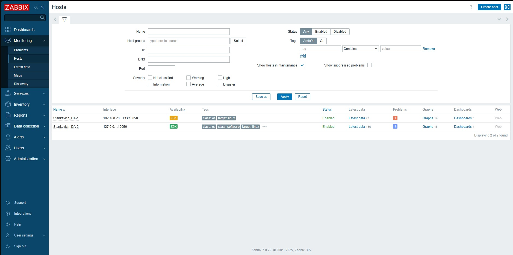
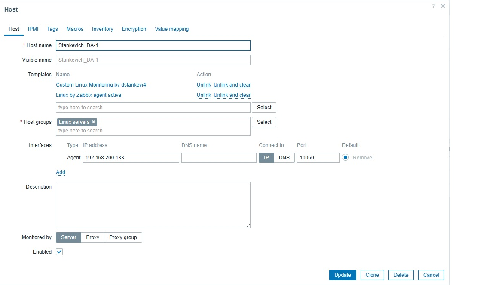
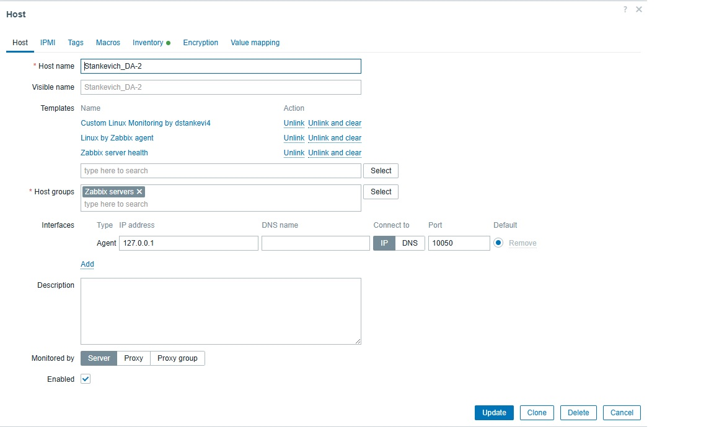
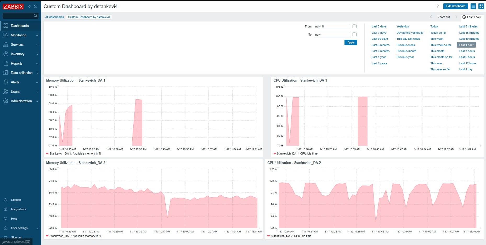

# Домашнее задание к занятию «Система мониторинга Zabbix. Часть 2»

Выполнил: Станкевич Д.А.

## Задание 1

Создан шаблон для мониторинга CPU и RAM.

## Задание 2-3

Добавлены хосты Stankevich_DA-1 и Stankevich_DA-2 с привязанными шаблонами.

### Выполнено:
1. Установка и настройка Zabbix Agent на двух хостах (192.168.200.133 и 127.0.0.1)
2. Добавление хостов в Zabbix Server с именами Stankevich_DA-1 и Stankevich_DA-2
3. Привязка шаблонов к каждому хосту:
   - Linux by Zabbix agent (стандартный шаблон)
   - Custom Linux Monitoring by dstankevi4 (собственный шаблон)

## Задание 4

Создан кастомный дашборд с графиками CPU и RAM.

### Дашборд включает виджеты:
1. График загрузки CPU для Stankevich_DA-1
2. График загрузки CPU для Stankevich_DA-2
3. График использования RAM для Stankevich_DA-1
4. График использования RAM для Stankevich_DA-2
